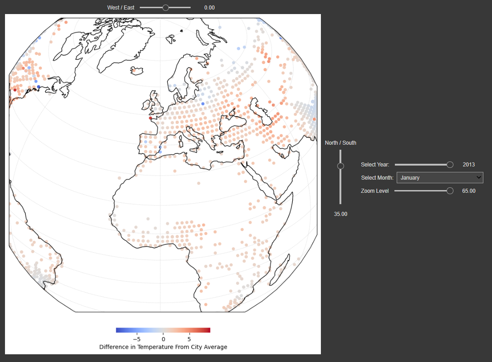
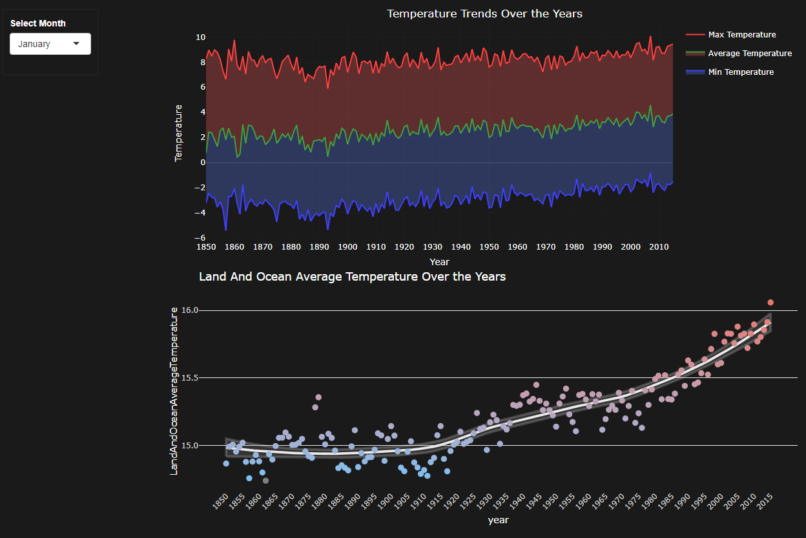
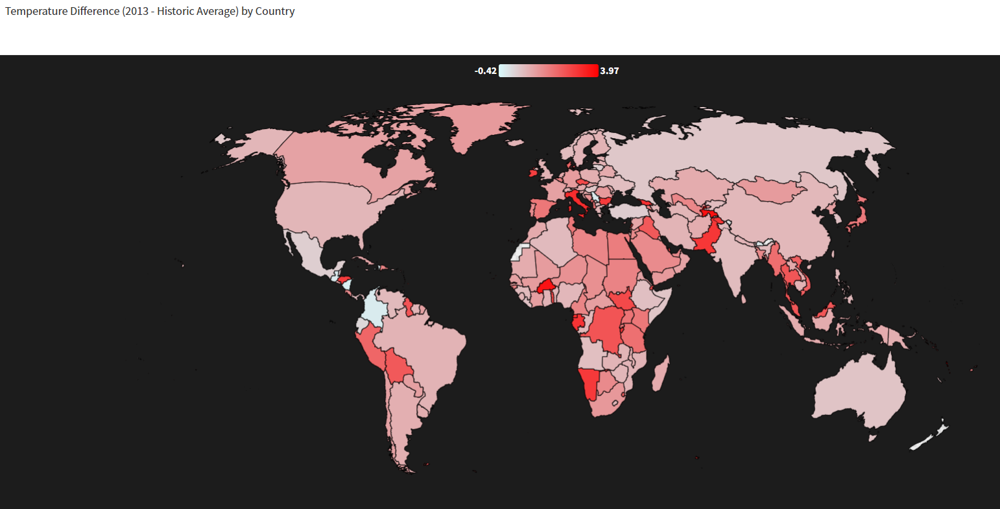

# Visualitzacio de Dades PR2 - Projecte de visualització

#### Àlex Bedmar Martínez

#### 12/01/2024

## Climate Change: Earth Surface Temperature Data

El conjunt de dades sobre el canvi climàtic ofereix una visió global de les tendències de la temperatura des de 1750, permetent l’exploració a diversos nivells. Amb més de 1.600 milions de registres, combina dades quantitatives i categòriques, proporcionant una perspectiva completa de les temperatures globals i locals.

## Visualitzacions

  
## Figura principal
  

  
## Segona figura
  

  
## Tercera figura
  

  
